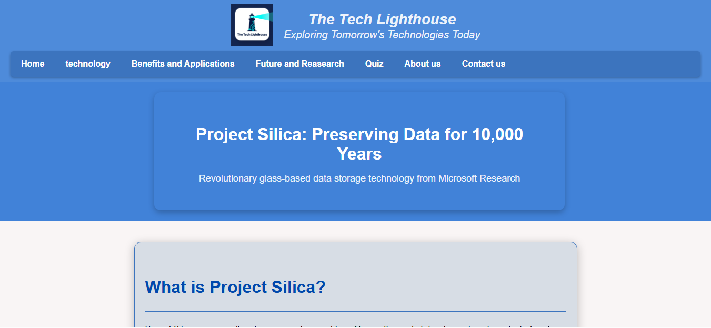

# 🚀 Project Silica



A multi-page educational website developed using **HTML, CSS, and JavaScript** to showcase Microsoft's **Project Silica**, an innovative long-term data storage technology that uses laser-etched glass for durable data preservation.

The website provides visitors with an interactive learning experience through informative content, multimedia resources, and a knowledge quiz.

---

## 📖 Overview

Project Silica explores the future of data storage by leveraging quartz glass as a highly durable medium capable of preserving information for thousands of years.

This website was created to present the concept in an engaging and accessible way through multiple sections covering:

* Project introduction
* Technology behind Project Silica
* Benefits and applications
* Future developments
* Interactive quiz
* Contact page

---

## ✨ Features

* 📱 Responsive multi-page website
* 🎨 Modern user interface built with CSS
* 🖼️ Image and video integration
* 🧠 Interactive quiz section
* 🧭 Easy-to-use navigation system
* 📚 Educational content about Project Silica
* ⚡ Lightweight and fully static implementation

---

## 🛠️ Technologies Used

### Frontend

* HTML5
* CSS3
* JavaScript

### Media

* Images
* Embedded videos

---

## 📂 Project Structure

```text
Project-Silica/
│
├── homepage.html
├── about.html
├── benefits.html
├── technology.html
├── future.html
├── contact.html
├── quiz.html
│
├── CSS/
│   └── style.css
│
├── JS/
│   └── script.js
│
├── images/
│
└── videos/
```

---

## 🚀 Getting Started

### Live Demo

[View the live website](https://edwinuniv.github.io/project-silica/)

### Option 1: Open Locally

1. Clone the repository:

```bash
git clone https://github.com/Edwinuniv/project-silica.git
```

2. Open:

```text
homepage.html
```

in any modern web browser.

### Option 2: GitHub Pages

If GitHub Pages is enabled, simply visit:

```text
https://Edwinuniv.github.io/project-silica/
```

---

## 🎯 Learning Objectives

This project helped develop skills in:

* Frontend web development
* Website structure and navigation
* Responsive design principles
* JavaScript interactivity
* Multimedia integration
* User experience design

---

## 🔮 Future Improvements

* Enhanced animations and transitions
* Improved mobile responsiveness
* Expanded quiz functionality
* Accessibility improvements
* Dark mode support
* Additional Project Silica research content

---

## 👨‍💻 Author

**Edwin Mouawad**

Computer Science Student
Software Engineering • AI • Cybersecurity • Full-Stack Development

GitHub: https://github.com/Edwinuniv
LinkedIn: https://www.linkedin.com/in/edwin-mouawad-525616362/

---

⭐ If you found this project interesting, consider giving it a star!
